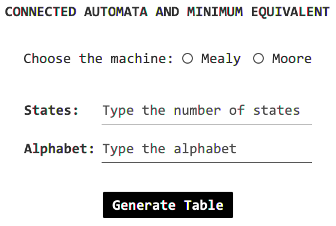

# Minimization of connected Mealy & Moore machines

## Description 🤖

This program receives as input a finite state automaton M and gives as output its connected and minimized automaton M'.

## Documentation 📃

Check the instruction manual of the program [here](docs/InstructionManual.pdf)

## Technical conditions 🛠️

- Programming Language 💱 : [Java](https://www.java.com/es/) [8](https://www.oracle.com/java/technologies/downloads/).
- Operating systems used 💻 : Windows 10 and MacOS Big Sur.
- Integrated Development Environment used 👨🏻‍💻 : [Visual Studio Code](https://code.visualstudio.com/download) v. 1.65.2
- External Libraries used: [JFoeniX-8.0.10](https://github.com/jfoenixadmin/JFoenix)
- Installation 🔧 : Click on Code, then on Download ZIP.

## Authors 🖊️

[CarlosJPantoja](https://github.com/CarlosJPantoja)\
[TheLordJuanes](https://github.com/TheLordJuanes)
